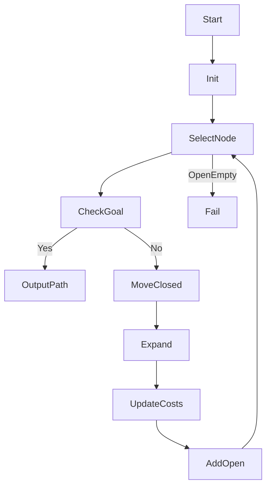
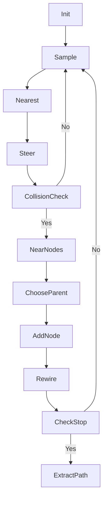
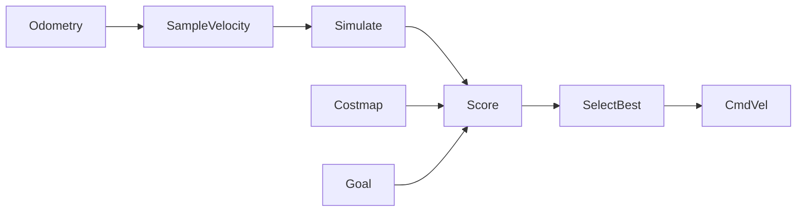
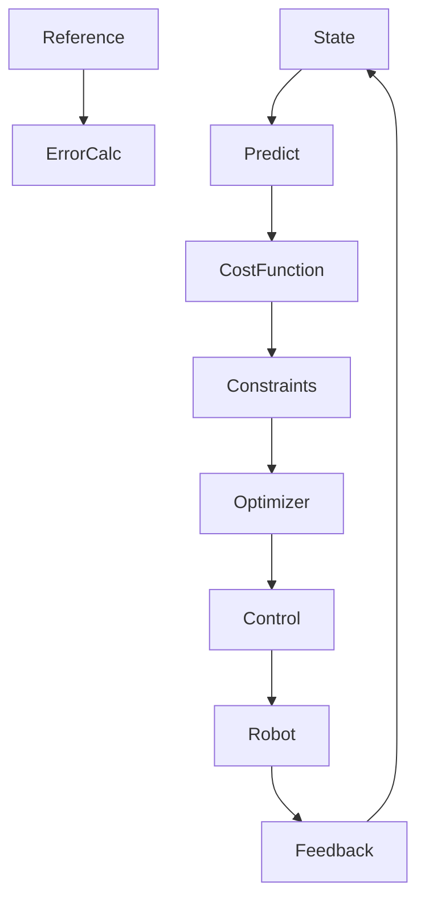
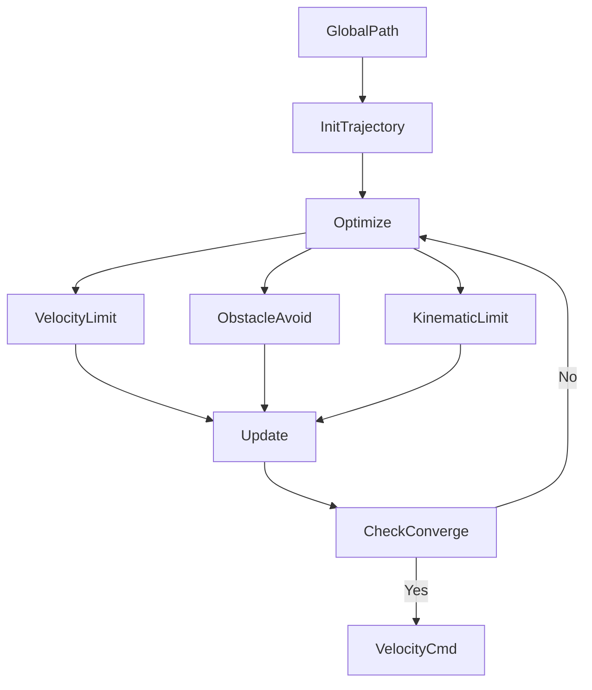
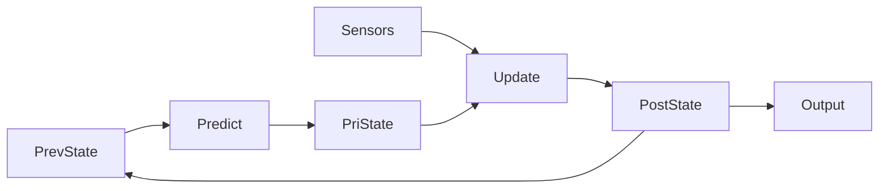
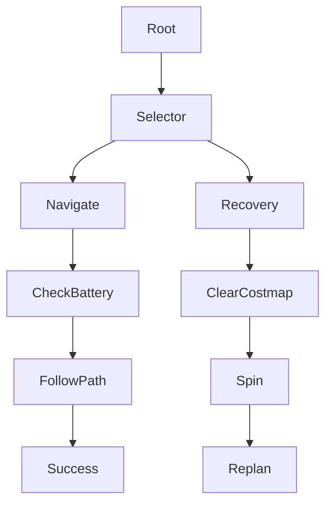

# 🤖 System Architectures & Flowcharts for Algorithms in Autonomous Mobile Robotics

This repository presents **clean, GitHub-compatible system architectures and process flowcharts** for the **core algorithms used in Autonomous Mobile Robots (AMRs)**.

It is designed for:

* 🎓 Robotics & AI students
* 🧠 Autonomous systems researchers
* 🤖 ROS / Nav2 developers
* 📘 Exam & interview preparation

---

## 📌 Algorithms Covered

* Global Path Planning (A*, RRT*)
* Local Reactive Control (DWA)
* Optimization-Based Control (MPC)
* Local Trajectory Optimization (TEB)
* State Estimation (EKF)
* Decision Making (Behavior Trees)

---

## 🧠 1. Global Path Planning — A* Algorithm

**Type:** Grid-based Graph Search
**Purpose:** Find the shortest collision-free path from start to goal in a static map.

### 🔑 Core Idea

A* evaluates nodes using:

[
f = g + h
]

* `g` → cost from start
* `h` → heuristic distance to goal

### 🔁 Process Flowchart (GitHub-Safe)

### 🛠 Practical Notes

* Heuristic must be admissible
* Grid resolution impacts speed
* Output path usually needs smoothing

---

## 🌲 2. Global Path Planning — RRT*

**Type:** Sampling-Based Planner
**Purpose:** Optimal planning in high-dimensional or continuous spaces.

### 🔑 Core Idea

Randomly sample space, grow a tree, and **rewire nodes** to reduce path cost.

### 🔁 Process Flowchart (GitHub-Safe)

### 🛠 Practical Notes

* Probabilistically complete
* Asymptotically optimal
* Requires post-processing for smooth motion

---

## 🚗 3. Local Reactive Control — Dynamic Window Approach (DWA)

**Type:** Velocity Space Sampling
**Purpose:** Generate real-time safe velocity commands.

### 🔑 Core Idea

Search in velocity space `(v, w)` instead of Cartesian space.

### 🔁 Process Flowchart (GitHub-Safe)

### 🛠 Practical Notes

* Very fast and robust
* Can be myopic
* Sensitive to parameter tuning

---

## 📐 4. Advanced Control — Model Predictive Control (MPC)

**Type:** Optimization-Based Control
**Purpose:** High-precision trajectory tracking with constraints.

### 🔑 Core Idea

Predict future states, optimize control inputs, apply first action only.

### 🔁 Process Flowchart (GitHub-Safe)

### 🛠 Practical Notes

* High computational load
* Requires accurate dynamics
* Superior smoothness vs DWA

---

## 🧵 5. Local Planner — Timed Elastic Band (TEB)

**Type:** Trajectory Optimization
**Purpose:** Smooth, time-optimal local trajectories.

### 🔑 Core Idea

Treat trajectory as an elastic band and optimize pose and timing.

### 🔁 Process Flowchart (GitHub-Safe)

### 🛠 Practical Notes

* Uses graph optimization
* Handles non-holonomic constraints
* More stable in narrow passages

---

## 📍 6. State Estimation — Extended Kalman Filter (EKF)

**Type:** Recursive Bayesian Filter
**Purpose:** Fuse noisy sensors into accurate state estimation.

### 🔑 Core Idea

Linearize nonlinear models using Jacobians.

### 🔁 Process Flowchart (GitHub-Safe)

### 🛠 Practical Notes

* Efficient and fast
* Depends on noise models
* Standard in ROS localization

---

## 🌳 7. Decision Making — Behavior Trees (BT)

**Type:** Hierarchical Control Architecture
**Purpose:** Manage task switching and recovery behaviors.

### 🔑 Core Idea

Tree-based decision flow using selectors and sequences.

### 🔁 Process Flowchart (GitHub-Safe)

### 🛠 Practical Notes

* Modular and readable
* Easier debugging than FSMs
* Industry standard in Nav2

---

## 📚 Recommended Reading

### 📘 Books

* *Probabilistic Robotics* — Thrun, Burgard, Fox
* *Planning Algorithms* — Steven LaValle
* *Robotics: Modelling, Planning and Control* — Siciliano

### 📄 Research Papers

* Koenig & Likhachev — A*
* Karaman & Frazzoli — RRT*
* Fox et al. — Dynamic Window Approach

### 🧪 Practical Resources

* ROS 2 Navigation (Nav2) Documentation
* Open Motion Planning Library (OMPL)
* g2o Graph Optimization Framework

---

## 📌 License

This repository is intended for **educational and research use**.

